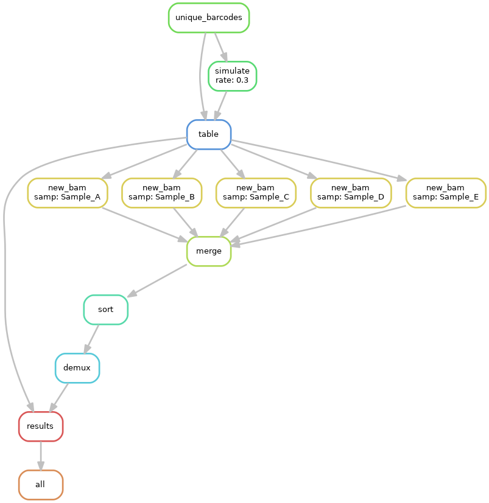

# demux
A pipeline for running single-cell demultiplexing simulations with [demuxlet](https://github.com/statgen/demuxlet).

# Introduction 
**demux** is a Snakemake pipeline for simulating a multiplexed droplet scRNA-seq (dscRNA-seq) experiment using data from individual scRNA-seq samples and quantifying the effectiveness of deconvoluting the sample identify of each cell in the simulated dataset with **demuxlet**. Such an analysis is helpful for reducing the cost of library preparations for dscRNA-seq experiments.

Here is an example flowchart, depicting the **demux** pipeline with five input samples.


Each step is briefly described below:
- `unique_barcodes`: aggregate cell barcodes across all samples provided as input and remove any cell barcodes that appear more than once
- `simulate`: simulate a multiplexed dscRNA-seq experiment with a specified doublet rate (default: 0.3). The doublet rate specifies the percentage of cells from the aggregate dataset expected to be found in doubletes. We define two types of doublets:
  1. doublets containing cells from different samples
  2. doublets containing cells from the same samples
- `table`: create a reference table mapping the original (ground truth) barcodes to the new barcodes (for analyzing **demuxlet** performance)
- `new bam`: edit the BAM files corresponding to each sample provided as input to reflect simulated doublets. For ever pair of cells randomly selected to be in a doublet, we change the cell barcode of one cell in the pair to match that of the other cell. 
- `merge`: merge the edited BAM files into one BAM file to reflect a multiplexed experiment.
- `sort`: sort the merged BAM file
- `demux`: run **demuxlet** with the BAM file as input
- `results`: analyze **demuxlet** performance

# Download
Execute the following command.
```
git clone https://github.com/zrcjessica/demux.git
```

# Setup
## Dependencies
The pipeline is written as a Snakefile which can be executed via [Snakemake](https://snakemake.readthedocs.io). We recommend installing version 5.18.0:
```
conda create -n snakemake -c bioconda -c conda-forge 'snakemake==5.18.0' --no-channel-priority
```
We highly recommend you install [Snakemake via conda](https://snakemake.readthedocs.io/en/stable/getting_started/installation.html#installation-via-conda) like this so that you can use the `--use-conda` flag when calling `snakemake` to let it [automatically handle all dependencies](https://snakemake.readthedocs.io/en/stable/snakefiles/deployment.html#integrated-package-management) of the pipeline. Otherwise, you must manually install the dependencies listed in the [env files](envs).

## Input
**demux** minimally requires the following inputs, which must be [specified in the `config.yml` file](https://github.com/zrcjessica/demux#executing-the-pipeline-on-your-own-data): 
- a list of individually processed samples 
- for each sample above, the following [Cell Ranger](https://support.10xgenomics.com/single-cell-gene-expression/software/pipelines/latest/output/overview) outputs from the `cellranger count` pipeline:
  - [Barcoded BAM](https://support.10xgenomics.com/single-cell-gene-expression/software/pipelines/latest/output/overview#count)
  - Cell barcodes from [Filtered Feature-Barcode Matrix](https://support.10xgenomics.com/single-cell-gene-expression/software/pipelines/latest/output/matrices)
- a vcf file containing the genotypes of all samples from above

[See below for additional input parameters.](https://github.com/zrcjessica/demux#executing-the-pipeline-on-your-own-data)

It is recommended to symlink your data into the gitignored `data/` folder:
```
ln -s /path/to/your/data data
```
If you ever need to switch the input to a different dataset, you can just change the symlink path.

## Output
**demux** returns a table summarizing the performance of **demuxlet** on the simulated data and a plot showing the precision-recall curves. 

You can also symlink your output, if you think you might want to change it in the future:
```
ln -s /iblm/netapp/data1/jezhou/Telese_Rat_Amygdala/demultiplex_simulation/out out
```

# Execution
Locally:
```
./run &
```
__or__ on a SGE cluster:
```
qsub run
```

## Executing the pipeline on your own data
You must modify [the config.yml file](config.yml) to specify paths to your data. The config file is currently configured to run the pipeline on our data (in the git-ignored `data/` folder). The config file contains the following variables:
- `data`*: The `data` variable contains nested variables for each of your samples and their correpsonding `reads`, and `barcodes` files (10X output) as well as the sample's `vcf_id`. 
- `vcf`*: Give the path to the vcf file containing genotypes for all samples nested in the `data` variable.
- `samples`: List the samples from those nested in the `data` variable that you want to be included as input to the demultiplexing simulation. If this line is not provided or commented out, all samples from the `data` variable will be used.
- `rate`: Doublet rate to be used for demultiplexing simulations. Defaults to 0.3.
- `out`: Path to directory in which to write output files. If not provided, defaults to `out`. The directory will be created if it does not already exist. 

\* Inputs required

# Files and directories
### [Snakefile](Snakefile)
A [Snakemake](https://snakemake.readthedocs.io/en/stable/) pipeline for running the demultiplexing simulation.

### [config.yml](config.yml)
Config file that defines options and input for the pipeline.

### [scripts/](scripts)
Various scripts used by the pipeline. See the [script README](scripts/README.md) for more information.

### [envs/](envs)
The dependencies of our pipeline, specified as `conda` [environment files](https://docs.conda.io/projects/conda/en/latest/user-guide/tasks/manage-environments.html#create-env-file-manually). These are used by Snakemake to automatically install our dependencies at runtime.

### [run](run)
An example bash script for executing the pipeline using `snakemake` and `conda`. Any arguments to this script are passed directly to `snakemake`.
